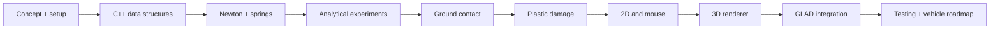

# Documentation map

```mermaid
flowchart LR
 A[Concept + setup] --> B[C++ data structures]
 B --> C[Newton + springs]
 C --> D[Analytical experiments]
 D --> E[Ground contact]
 E --> F[Plastic damage]
 F --> G[2D and mouse]
 G --> H[3D renderer]
 H --> I[GLAD integration]
 I --> J[Testing + vehicle roadmap]
```

See [[00 - SoloPhysics Documentation Hub]] for the complete 20-note reading order.
